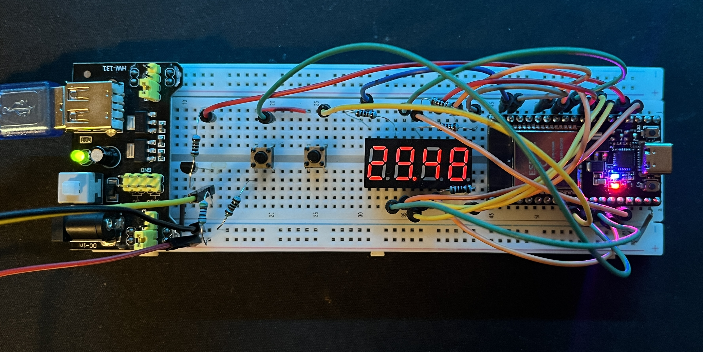
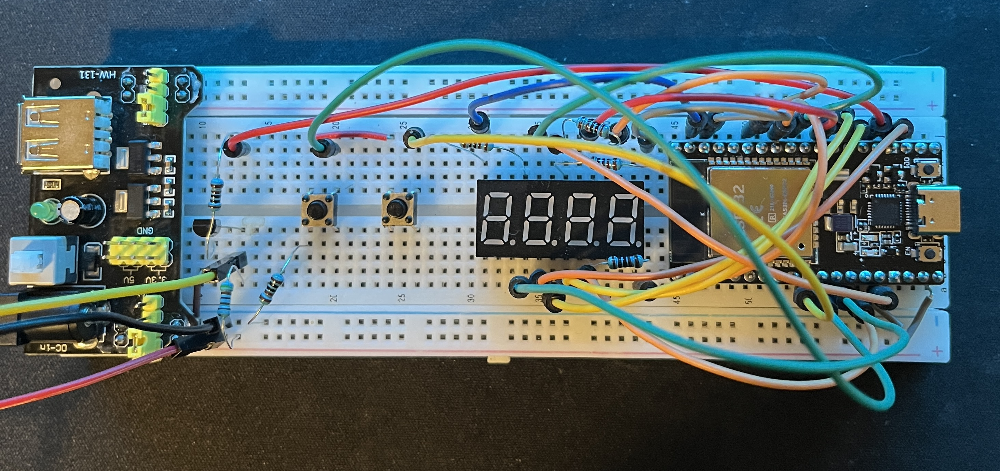
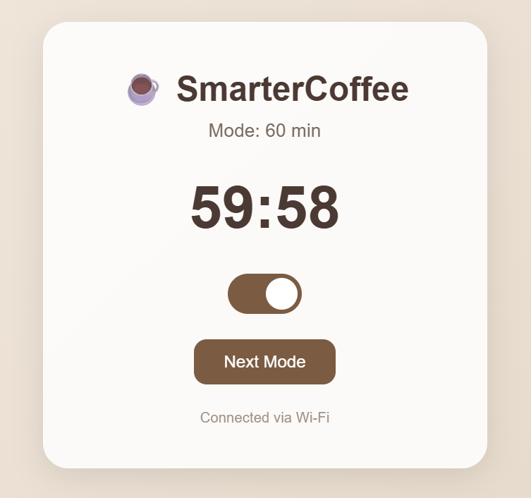
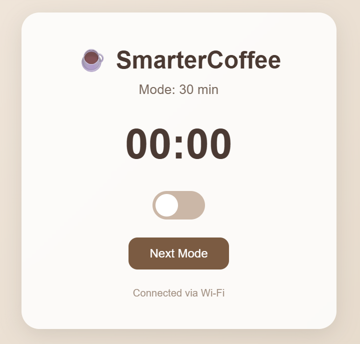

# ☕ SmarterCoffee (ESP32 + WiFi)

simple project that turns a normal coffee maker into a “smart” one.  
uses an **ESP32**, **relay**, **7-segment display**, and **two buttons** for mode + start/stop.  
you can also control it from your phone or laptop over Wi-Fi through a little web interface.

---

## 🧠 what it does
- runs a countdown timer (30 / 45 / 60 / 120 min modes)
- toggles a relay that powers the coffee machine
- shows time left on a 4-digit 7-segment display
- can be controlled by:
  - hardware buttons (start / cycle)
  - or a Wi-Fi web dashboard with live updates + a toggle switch

---

## 🪛 Wiring Diagram

The **ESP32** controls a coffee machine relay and a 4-digit 7-segment display.  
Because the relay module is **active-low**, a small **NPN transistor** is used as a **NOT gate** so the ESP32 can safely control it with an active-high output.

---

### ⚡ Relay + Transistor Circuit

| Component | Connection | ESP32 Pin | Notes |
|------------|-------------|-----------|-------|
| **GPIO 2** | → 1 kΩ resistor → **Transistor base** | GPIO 2 | Control signal |
| **Transistor collector** | → **Relay IN** | — | Acts as NOT gate (inverts signal) |
| **Transistor emitter** | → **GND** | — | Common ground |
| **Relay VCC** | → **5V** | — | Power for relay coil |
| **Relay GND** | → **GND** | — | Shared with ESP32 |
| **Relay COM** | → **Coffee machine line** | — | Power line to switch |
| **Relay NO (Normally Open)** | → **Coffee machine load** | — | Closes when relay active |

---

### 🔘 Buttons

| Button | ESP32 Pin | Description |
|---------|------------|-------------|
| **Start Button** | GPIO 26 | Starts countdown / brew |
| **Cycle Button** | GPIO 27 | Short press = change mode<br>Long press = stop timer |

---

### 🧮 7-Segment Display (4-Digit, 12-Pin)

| Display Pin | Function | ESP32 Pin |
|--------------|-----------|-----------|
| 1 | Segment **A** | GPIO 18 |
| 2 | Segment **B** | GPIO 17 |
| 3 | Segment **C** | GPIO 16 |
| 4 | Segment **D** | GPIO 15 |
| 5 | Segment **E** | GPIO 14 |
| 6 | Segment **F** | GPIO 13 |
| 7 | Segment **G** | GPIO 12 |
| 8 | Decimal Point **DP** | GPIO 4 |
| 9 | Digit 1 | GPIO 23 |
| 10 | Digit 2 | GPIO 22 |
| 11 | Digit 3 | GPIO 21 |
| 12 | Digit 4 | GPIO 19 |

🟢 **Display type:** Common Anode  
💡 **Brightness:** Controlled via software (`sevseg.setBrightness(100)`)

---

📷 _You can reference the circuit images below for clarity:_




## 🖥️ Web Interface

The ESP32 hosts its own mini webpage (stored in `page.h`) for remote control.

It displays the **current mode**, **countdown timer**, and includes a **toggle switch** and **Next Mode** button.

<p align="center">
  
  
</p>

features:
- toggle switch to start/stop brewing
- “Next Mode” button to cycle durations
- live countdown timer updated every second

---


## ⚙️ how to use
1. open `wifiCoffee.ino`
2. put your Wi-Fi credentials here:
   ```cpp
   const char* ssid = "YOUR_SSID_HERE";
   const char* password = "YOUR_SECURITY_KEY_HERE";
3. upload to your ESP32
4. open Serial Monitor → get the IP address
5. visit that IP in your browser (same Wi-Fi network)

## 🧵 extra notes

holding the cycle button for 1s while running cancels the countdown.

web dashboard syncs with physical buttons — either one works.

the IP address flashes on the display when Wi-Fi connects.

## 🛠️ dependencies

make sure you have:

SevSeg library (for 7-segment display)

WiFi.h and WebServer.h (included with ESP32 board support)

## 🧑‍💻 author

made by @odinlindal, Oct 2025
mostly for fun and caffeine reasons ☕
